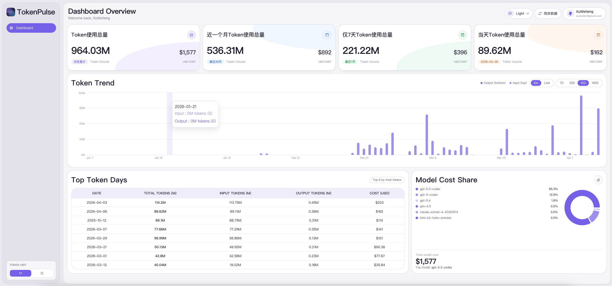

# TokenPulse

[English](./README.md) | [简体中文](./README.zh-CN.md)

一个面向个人使用的 Token 成本分析仪表盘，聚合 Codex / OpenClaw / Claude 本地会话数据，按模型和日期展示 Token 使用量与 USD 成本。



## 功能特性

- Dashboard 总览卡片：历史累计、近 30 天、近 7 天、当天 Token 与成本
- Token 单位切换：侧边栏支持 `M` 与 `亿` 之间切换
- Token 趋势图：支持 `Bar` / `Line` 切换与 7/30/90/180 天范围切换
- Top Token Days：按总 Token 排名展示高使用日期
- Model Cost Share：按模型成本占比展示饼图
- 一键同步数据：前端触发 `/api/sync-data`，自动备份并刷新数据

## 技术栈

- Next.js 16（App Router）
- React 19
- TypeScript
- Tailwind CSS 4
- Recharts
- Python（数据同步脚本）

## 项目结构

```text
.
├─ src/
│  ├─ app/
│  │  ├─ api/sync-data/route.ts      # 同步接口（触发 Python 脚本）
│  │  ├─ page.tsx                    # Dashboard 主页面
│  │  └─ layout.tsx
│  ├─ components/
│  │  ├─ dashboard/                  # 图表与面板组件
│  │  ├─ sync-data-button.tsx
│  │  ├─ theme-mode-select.tsx
│  │  └─ token-unit-toggle.tsx
│  └─ lib/
│     ├─ dashboard-data.ts           # 数据类型与聚合逻辑
│     └─ formatters.ts               # 展示格式化工具
├─ data/
│  ├─ dashboard-data.json            # Dashboard 数据源
│  └─ backups/                       # 同步时自动备份
├─ scripts/
│  └─ sync_dashboard_data.py         # 生成 dashboard-data.json
├─ model_cost.json                   # 模型价格配置
└─ sync_codex_token_usage_excel.py   # 导出 Excel 报表
```

## 快速开始

### 1. 安装依赖

```bash
npm install
```

### 2. 启动开发环境

```bash
npm run dev
```

默认访问：`http://localhost:3001`（若端口占用会自动切换）。

### 3. 生产构建

```bash
npm run build
npm run start
```

## 数据同步

### 方式 A：页面按钮同步（推荐）

点击页面右上角“同步数据”按钮，会调用 `POST /api/sync-data`：

1. 先备份 `dashboard-data.json` 和 Excel 文件到 `data/backups/`
2. 执行 Python 脚本重建数据
3. 刷新页面展示最新统计

### 方式 B：命令行同步

```bash
npm run sync:data
```

该命令会执行：`scripts/sync_dashboard_data.py`。

## 可用脚本

- `npm run dev`：启动开发服务器
- `npm run build`：构建生产包
- `npm run start`：启动生产服务
- `npm run lint`：运行 ESLint
- `npm run sync:data`：从本地会话数据生成 Dashboard 数据

## 数据来源与前置条件

默认会从以下目录读取本地会话数据：

- `~/.codex`
- `~/.openclaw`
- `~/.claude`

并结合 `model_cost.json` 进行成本计算。若你的目录结构不同，请调整脚本参数或接口实现。

## 说明

- 项目当前包含 ESLint 既有告警（与本次 README 变更无关）。
- 仓库内 `site-preview.png` 为本地部署页面截图，可按需更新。

## License

MIT
